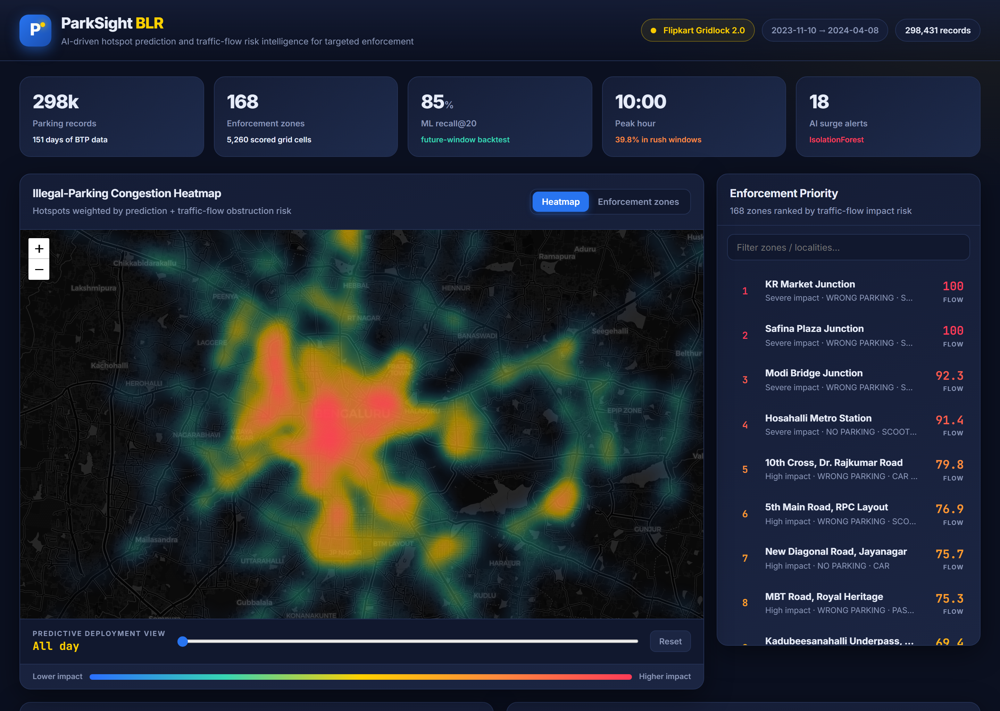
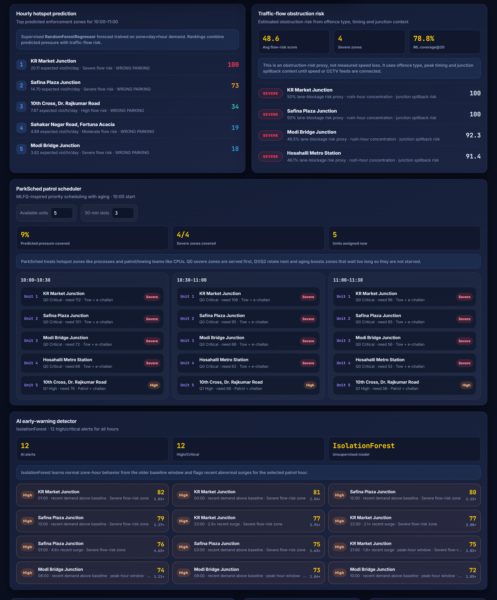
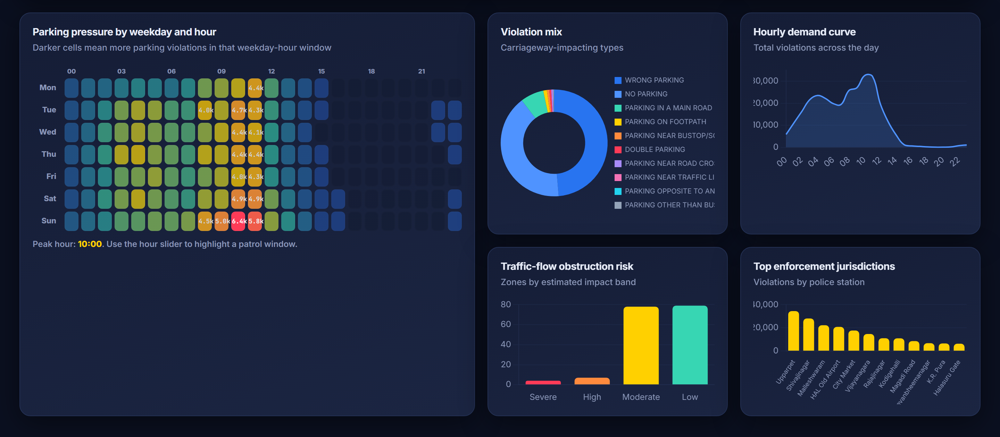

# ParkSight BLR — AI-Driven Parking Congestion Intelligence

> **Flipkart Gridlock Hackathon 2.0 · Round 2 (Prototype)**
> Problem statement: *Poor Visibility on Parking-Induced Congestion*

Parking enforcement in Bengaluru is **reactive and blind**. Patrol teams know illegal parking causes congestion, but they have no reliable way to decide **which junction to police first, at what hour, and why that spot matters for traffic flow.**

**ParkSight** turns **298,431 real Bengaluru Traffic Police parking-violation records** into an operational, control-room decision tool. In one dashboard it:

1. **Detects** chronic illegal-parking hotspots with geospatial clustering.
2. **Forecasts** hour-by-hour enforcement demand with a supervised ML model.
3. **Scores** traffic-flow obstruction risk with a transparent, calibration-ready proxy.
4. **Ranks** patrol zones by predicted enforcement value for any selected hour.
5. **Schedules** limited patrol units with *ParkSched*, an MLFQ-inspired priority scheduler.
6. **Warns early** about abnormal recent surges with an unsupervised anomaly detector.



---

## TL;DR — the headline insight

> **84.2% of all flow-weighted parking impact is concentrated in just the top 20 zones**, and the top 20 zones hold **74.5% of all violations**.

Enforcement doesn't only need *more* patrols — it needs **better-targeted** patrols.
**KR Market Junction** ranks #1 by traffic-flow impact (60,689 violations, peaking **08:00–11:00**), followed by Safina Plaza Junction and Modi Bridge Junction.

| What the data covers | Value |
|---|---|
| Real BTP records analysed | **298,431** |
| Date window | **2023-11-10 → 2024-04-08** (151 days) |
| Average violations / day | **~1,976** |
| Enforcement zones discovered | **168** |
| Scored ~165 m grid cells | **5,260** |
| Citywide peak hour | **10:00** (39.8% of violations fall in rush windows) |
| Severe / High flow-risk zones | **11** (4 Severe) |
| Live AI early-warnings raised | **18** |

*Top offence:* `WRONG PARKING` (164,964) · *Top vehicle:* `SCOOTER` (94,856) · *Busiest jurisdiction:* `Upparpet` station (34,468).

---

## Quick start

```bash
# 1. install deps
pip install -r requirements.txt

# 2. build analytics artifacts from the raw violation CSV
python3 pipeline/build_data.py

# 3. serve the dashboard
python3 -m http.server 8765 -d web
#    → open http://localhost:8765
```

On **Windows PowerShell**:

```powershell
py -m pip install -r requirements.txt
py pipeline\build_data.py
py -m http.server 8765 -d web
```

Or one command (rebuilds analytics only if missing, then serves):

```bash
./run.sh        # defaults to http://localhost:8765
```

> The pipeline expects the raw file `jan to may police violation_anonymized791b166.csv`
> in the **parent folder** of this project (next to the `parksight/` directory).

---

## Honest data note: what's measured vs modelled

ParkSight is deliberately transparent about its claims.

| Real, straight from the BTP CSV | Modelled (interpretable risk proxy) |
|---|---|
| Violation locations, timestamps (UTC→IST), vehicle types, offence labels, police stations, junctions, counts | Traffic-flow obstruction / lane-blockage risk |

The dataset has **no speed, queue-length or lane-occupancy fields**, so ParkSight does **not** claim measured delay. The traffic-flow scores are transparent obstruction-risk proxies built from offence type, rush-hour concentration and junction context — designed so they can later be **calibrated against live CCTV / speed feeds** in production.

---

## How it works — the six layers

```text
raw CSV (298K rows)
      │  pipeline/build_data.py  →  pandas · DBSCAN · RandomForest · IsolationForest
      ▼
web/data/*.json   (summary · hotspots · zones · temporal · breakdowns · ai_alerts)
      │
      ▼
web dashboard   →  Leaflet heatmap · zone ranking · ML hour slider · ParkSched · Chart.js
```

The middle band of the dashboard turns those layers into decisions you can act on:



### Layer 1 — Supervised ML hotspot forecast

A `RandomForestRegressor` trained at **zone × hour** level predicts *future* parking pressure, so the dashboard ranks where demand **will** be — not just where it has been.

```text
Features from earlier dates  →  future parking pressure for that zone-hour
```

Features include historical weighted/raw violations per day, active-day ratio, cyclic hour features, peak-hour flag, average severity & obstruction, junction share, CIRS / flow-impact score, recurrence, and zone size/location.

**Backtest design & holdout result (this build):**

```text
Train sample:       first 50% of dates → next 20% of dates
Validation sample:  first 70% of dates → last 30% of dates

ML recall@20:       85.0%     (top-20 predicted zones vs actual)
ML coverage@20:     78.8%     (share of future load they capture)
MAE:                0.0861    violations / zone-hour-day
RMSE:               0.3953    violations / zone-hour-day
```

A simpler **persistence backtest** (do hotspots persist?) scores **recall@20 = 90.0%, coverage = 79.5%** — confirming hotspots are stable enough to plan around. Dragging the hour slider re-ranks every zone using the model's hourly predictions.

### Layer 4 — Traffic-flow obstruction risk

Estimates obstruction risk from the fields available in the violation dump:

```text
Flow risk = CIRS + obstruction type + peak timing + junction spillback risk
```

| Violation type | Why it matters for flow |
|---|---|
| Parking near road crossing | Blocks turning traffic; intersection spillback |
| Parking near traffic light / zebra | Cuts signal discharge; pedestrian risk |
| Parking on a main road | Direct carriageway obstruction |
| Double parking | Effective lane loss |
| Footpath parking | Low vehicle-flow impact, high pedestrian risk |

### Layer 5 — ParkSched patrol scheduler

ParkSight converts predictions into a **deployable patrol plan** by reframing enforcement as an OS scheduling problem:

| OS concept | ParkSight equivalent |
|---|---|
| CPU | Patrol / towing / e-challan unit |
| Process | Hotspot enforcement zone |
| Priority | ML forecast + flow impact + recurrence + confidence |
| Time quantum | 30-minute patrol window |
| Aging | Waiting zones get a boost so they are never starved |

```text
Need = 0.35·ML forecast + 0.25·flow impact + 0.15·recurrence
     + 0.15·ML confidence + 0.10·lane-blockage risk

Q0 Critical → tow + e-challan first      Q2 Watch → round-robin rotation
Q1 High     → patrol / challan now        Q3 Low  → passive monitoring
```

Pick the number of available units and 30-minute slots, and ParkSched emits concrete assignments:

```text
10:00–10:30   Unit 1 → KR Market Junction
              Unit 2 → Safina Plaza Junction
              Unit 3 → Hosahalli Metro Station
```

### Layer 6 — AI early-warning detector

A second, **unsupervised** ML layer. An `IsolationForest` learns each zone-hour's normal baseline (first 120 dates) and scores the recent window (last 31 dates) against it. Abnormal recent surges — weighted by flow-impact risk — become early-warning alerts so units can pre-position **before** a surge hardens into a chronic choke. This build raised **18 alerts**. These are generated by the model, not hardcoded.

---

## Analytics at a glance

When-and-what context behind the rankings: a weekday × hour pressure surface, offence mix, the daily demand curve, flow-impact bands, and the busiest enforcement jurisdictions.



---

## Why it fits the brief

| Judging axis | How ParkSight delivers |
|---|---|
| **Robustness** | Built on 298K real BTP records (Nov 2023–Apr 2024). Rejected/duplicate rows are kept for audit but **validation-discounted to 0** so they never drive scores. |
| **ML / AI** | DBSCAN for hotspot discovery, `RandomForestRegressor` for zone-hour forecasting, `IsolationForest` for early-warning anomaly detection. |
| **Innovation** | Fuses historical intelligence, hour-wise ML prediction, flow-obstruction scoring **and** an MLFQ patrol scheduler in one tool. |
| **Clarity** | Every zone explains *why*: offence mix, vehicle type, peak window, recurrence and impact evidence. |
| **Operational value** | Output is directly actionable — which zone, what hour, what offence, what vehicle, what enforcement action. |

---

## Project structure

| Path | Role |
|---|---|
| `pipeline/build_data.py` | Clean → grid-bin → CIRS → DBSCAN zones → ML forecast → flow-risk → scheduler metadata → anomaly detector → JSON |
| `web/index.html`, `web/styles.css` | Dashboard layout and styling |
| `web/app.js` | Loads JSON, ranks zones, builds the ParkSched schedule, renders map / list / modals / charts |
| `web/data/*.json` | Precomputed analytics artifacts consumed by the front end |
| `run.sh` | One-command build-if-needed + serve |

---

## 90-second demo script

1. **Open dashboard** — "298K real BTP parking-violation records."
2. **Heatmap** — "This isn't just volume; heat is weighted by traffic-flow obstruction risk."
3. **ML panel** — "Layer 1 predicts which zones need enforcement at the selected hour."
4. **Drag slider to 10:00** — "The ranking re-orders using ML-predicted zone-hour demand."
5. **ParkSched** — "With five units, it builds a 30-minute patrol plan using MLFQ priority + aging."
6. **Click KR Market Junction** — "High volume, peak 08:00–11:00, severe flow risk, specific action."
7. **AI early-warning** — "IsolationForest flags abnormal recent surges to pre-position units."
8. **Be honest on impact** — "Flow score is a calibrated risk proxy, not measured delay; production calibrates it with speed/CCTV feeds."

---

*Prototype built for the Flipkart Gridlock Hackathon 2.0. Data: anonymized Bengaluru Traffic Police parking-violation records. All metrics above were produced by the latest `pipeline/build_data.py` run.*
